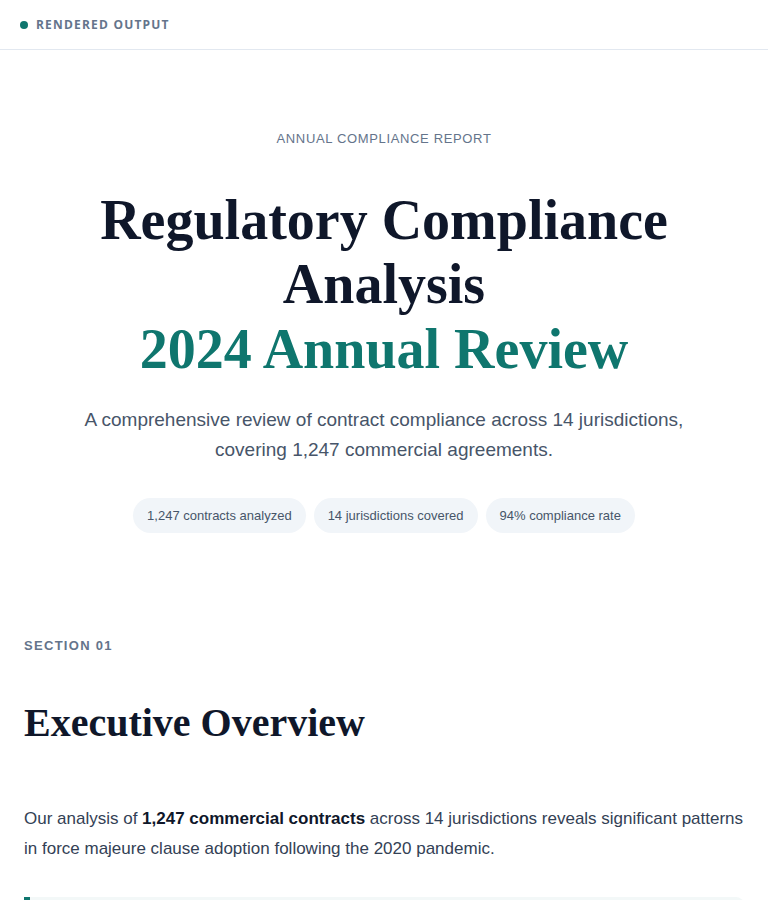

<div align="center">

# CAML

**Corpus Article Markup Language**

A human-readable markdown superset for authoring beautiful, interactive legal articles and knowledge bases.

[](https://open-source-legal.github.io/os-legal-caml/)
[](LICENSE)
[](https://github.com/Open-Source-Legal/os-legal-caml/actions/workflows/ci.yml)

</div>

---

<!-- Hero screenshot of the rendered full article -->
<p align="center">
  
</p>

<p align="center">
  <em>Write like markdown. Render like a publication.</em> ·
  <a href="https://open-source-legal.github.io/os-legal-caml/"><strong>View Interactive Demo →</strong></a>
</p>

---

## Packages

| Package | Description | |
|---------|-------------|-|
| [`@os-legal/caml`](packages/caml) | Zero-dependency parser. Parses `.caml` source into a typed JSON IR. | `npm i @os-legal/caml` |
| [`@os-legal/caml-react`](packages/caml-react) | React renderer with themed components, interactive blocks, and customizable design tokens. | `npm i @os-legal/caml-react` |

## Quick Start

```typescript
import { parseCaml } from "@os-legal/caml";
import { CamlArticle, CamlThemeProvider } from "@os-legal/caml-react";

const doc = parseCaml(camlSource);

<CamlThemeProvider>
  <CamlArticle document={doc} />
</CamlThemeProvider>
```

## Block Types

CAML supports **10 block types** for rich legal articles:

**Content** · Prose · Cards · Pills · Tabs
**Data** · Timeline · Map (US) · Case History · Corpus Stats
**Actions** · CTA · Signup

[See all blocks in the interactive Storybook →](https://open-source-legal.github.io/os-legal-caml/)

## CAML Syntax

```
---
hero:
  title:
    - "Contract Analysis"
    - "{2024 Review}"
  subtitle: A comprehensive regulatory compliance review.
---

::: chapter {#findings, theme: dark}
## Key Findings

Analysis of **1,247 contracts** reveals significant trends.

:::: cards {columns: 2}
- **Force Majeure** | 89% of contracts | #0f766e
  Updated language addressing pandemic and cyber events.

- **Data Protection** | 94% of contracts | #2563eb
  GDPR and CCPA compliance provisions.
::::

:::
```

Chapters use `:::`, blocks inside chapters use `::::`, tab sub-fences use `:::::`.

## License

MIT
